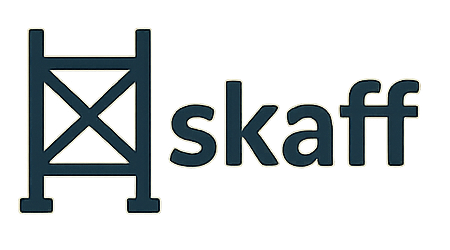

<p align="center">
  
</p>

# Skaff

<p align="center"><strong>TypeScript-powered scaffolding toolkit</strong> for shipping consistent, reproducible projects from curated templates.</p>

<p align="center">
  <a href="https://timonteutelink.github.io/skaff">Documentation</a>
  &nbsp;&nbsp;•&nbsp;&nbsp;
  <a href="https://discord.gg/efVC93Cr">Discord</a>
</p>

<p align="center">
  <a href="https://github.com/timonteutelink/skaff/actions/workflows/releaseLib.yml"></a>
  <a href="https://www.npmjs.com/package/@timonteutelink/skaff"></a>
  <a href="https://www.npmjs.com/package/@timonteutelink/skaff-lib"></a>
  <a href="https://www.npmjs.com/package/@timonteutelink/template-types-lib"></a>
  
</p>

Skaff pairs a fast CLI, a Next.js web dashboard, and shared TypeScript libraries so teams can scaffold new services, replay template upgrades, and standardize setups. The [documentation site](https://timonteutelink.github.io/skaff) walks through each workflow in depth; this README highlights the essentials and points to the right guide.

## Why Skaff

Skaff focuses on developer ergonomics and reproducibility:

- **Guided project creation.** Render templates from the CLI or web UI, validate answers with Zod, and review a Git diff before anything touches your repository. ([Introduction](https://timonteutelink.github.io/skaff/docs/introduction))
- **Repeatable upgrades.** Save template settings once and rerun the template later to generate patch files that capture only upstream changes. ([Core concepts](https://timonteutelink.github.io/skaff/docs/getting-started/core-concepts))
- **Composable features.** Break large starters into subtemplates so optional modules, jobs, or stacks can be added on demand. ([Template authoring guide](https://timonteutelink.github.io/skaff/docs/authoring))
- **Automation-ready tooling.** Every workflow is scriptable and available as a library, making Skaff easy to embed in CI or internal developer platforms. ([CLI workflows](https://timonteutelink.github.io/skaff/docs/cli))


## Components at a glance

| Surface                                            | Role                                                                                  |
| -------------------------------------------------- | ------------------------------------------------------------------------------------- |
| **CLI (`apps/cli`)**                               | Primary interface for project creation, diff preparation, and automation. Published on npm, Bun, and as standalone binaries. |
| **Web app (`apps/web`)**                           | Next.js dashboard with schema-driven forms, diff previews, and project management for teams that prefer a GUI. |
| **Core runtime (`packages/skaff-lib`)**            | Shared rendering and diffing engine consumed by the CLI, web app, and custom integrations. |
| **Template types (`packages/template-types-lib`)** | Typed helpers for `templateConfig.ts` files, subtemplate wiring, migrations, and side effects. |

Keep the [Introduction](https://timonteutelink.github.io/skaff/docs/introduction) open while exploring for extra context.

## Get started

The [Getting started](https://timonteutelink.github.io/skaff/docs/getting-started/) section of the docs walks you through the first run. The summaries below show what to expect.

### CLI quickstart

Follow the [CLI quickstart](https://timonteutelink.github.io/skaff/docs/getting-started/cli-quickstart) to render your first project:

1. **Install the CLI.** Use `bunx`/`npx` for one-off runs or install globally if you prefer a persistent binary.
   ```bash
   bunx @timonteutelink/skaff --version
   # or
   npm install -g @timonteutelink/skaff
   ```
   Verify the installation with `skaff --help`.

2. **Register template sources.** Skaff reads configuration from `~/.config/skaff/settings.json` (override with `SKAFF_CONFIG_PATH`). Point it at your template directories:
   ```bash
   skaff config add ~/skaff-example-templates TEMPLATE_DIR_PATHS
   skaff config get TEMPLATE_DIR_PATHS --format table
   ```
   You can also render straight from a Git repository by passing `--repo <git-url>`.

3. **Generate a project.** Name the destination folder, choose a template, and answer the schema-driven prompts.
   ```bash
   skaff project new my-service fastapi
   ```
   Inspect the diff viewer, then accept the patch to write files to disk.

4. **Continue exploring.**
   - List available templates with `skaff template list --format table`.
   - Replay saved answers from `templateSettings.json` using `skaff project from-settings <path>`.
   - Browse the [CLI workflows](https://timonteutelink.github.io/skaff/docs/cli) for automation, updates, and subtemplate runs.

### Web quickstart

Prefer a graphical workflow? The [Web quickstart](https://timonteutelink.github.io/skaff/docs/getting-started/web-quickstart) shows how to launch the Next.js interface.

1. **Start the web app.** Run the Docker image for the fastest setup:
   ```bash
   docker run --rm -p 3000:3000 \
     -v ~/.config/skaff:/app/.config/skaff \
     -v ~/.cache/skaff:/app/.cache/skaff \
     -v ~/projects:/projects \
     timonteutelink/skaff-web:latest
   ```
   Or run it from source:
   ```bash
   bun install
   bun --filter apps/web dev
   ```

2. **Confirm template access.** Use the CLI or the Templates view’s “Load from GitHub” action to add repositories. Both surfaces update the same configuration file, so changes are shared instantly.

3. **Generate a project visually.**
   - Pick a template from the library to open its generated form.
   - Complete required and optional fields; validation hints appear inline.
   - Click **Preview diff** to inspect every change before writing to disk.
   - Choose a destination folder and click **Generate** to write the files.

Return to the UI later to apply template updates, add subtemplates, or run template-defined commands without leaving the browser. The README and the [web guide](https://timonteutelink.github.io/skaff/docs/web) cover additional tips.

### Learn the core concepts

Understanding a few ideas from the [Core concepts](https://timonteutelink.github.io/skaff/docs/getting-started/core-concepts) guide makes every workflow easier:

- **Templates and repositories.** Templates live in Git repositories under `root-templates/<name>/` and export a `templateConfig.ts` that defines prompts, files, and hooks.
- **Template settings.** Skaff validates your answers with Zod and stores them as `templateSettings.json` so future runs can replay the exact same configuration.
- **Instances and subtemplates.** Each template invocation is tracked with an instance ID, letting you add optional modules later or re-run only part of a project.
- **Diffs and revisions.** Templates render inside a temporary Git repo and produce a patch before writing to disk, keeping upgrades transparent and reviewable.

## Installation options

Skaff ships through multiple channels so you can pick the best fit for your environment.

### Run on demand

Use `bunx` (or `npx`) to execute Skaff without a global install:

```bash
bunx @timonteutelink/skaff --version
```

### Global install

Install the CLI once and reuse it:

```bash
npm install -g @timonteutelink/skaff
# or, with bun:
bun add -g @timonteutelink/skaff
```

### GitHub releases

Prebuilt binaries for major platforms are attached to each GitHub release. Download the appropriate binary and place it on your `PATH`.

### Nix flake

Skaff is packaged as a Nix flake. Run it directly from GitHub or from a local checkout:

```bash
# run directly from GitHub
nix run github:timonteutelink/skaff

# or from a local checkout:
nix develop       # enter a dev shell with all dependencies
nix build         # build the package
nix run           # execute the CLI
```

## Workflow highlights

### CLI workflows

The [CLI guide](https://timonteutelink.github.io/skaff/docs/cli) covers everything from configuring template sources to automating upgrades. Key commands include:

- `skaff project new <name> [template]` — create a new project or subproject.
- `skaff project apply <path>` — apply a generated diff to an existing workspace.
- `skaff project add-subtemplate` — layer optional features onto an existing project.
- `skaff help [command]` — print detailed help for any command.

### Web app guide

The [web guide](https://timonteutelink.github.io/skaff/docs/web) explains how to collaborate through the Next.js dashboard, browse template catalogs, inspect diffs, and apply patches without leaving the browser.

### Template authoring

Ready to build your own templates? The [template authoring docs](https://timonteutelink.github.io/skaff/docs/authoring) describe repository layout, schema authoring, migrations, and testing patterns so your starters remain upgradeable.

## Reference & additional resources

- [Configuration reference](https://timonteutelink.github.io/skaff/docs/reference/configuration)
- [TemplateConfig API](https://timonteutelink.github.io/skaff/docs/reference/template-config)
- [CLI command reference](https://timonteutelink.github.io/skaff/cli/)
- [skaff-lib API reference](https://timonteutelink.github.io/skaff/skaff-lib/)
- [template-types-lib API reference](https://timonteutelink.github.io/skaff/template-types-lib/)
- [Examples and recipes](https://timonteutelink.github.io/skaff/docs/examples)
- [Contributing guide](https://timonteutelink.github.io/skaff/docs/contributing)

## Contributing

We appreciate contributions of all kinds. Review [CONTRIBUTING.md](./CONTRIBUTING.md) and the [contributing docs](https://timonteutelink.github.io/skaff/docs/contributing) for the full process. In short:

- Set up the monorepo with `bun install` and build the core libraries.
- Run `bun test` for unit tests, and `bun format` / `bun lint` before committing.
- Keep pull requests focused; CI runs automatically on every PR against `main`.
- Releases follow semantic versioning and are handled by maintainers via GitHub Actions.

## Community

- **Documentation:** [timonteutelink.github.io/skaff](https://timonteutelink.github.io/skaff)
- **Discord:** [https://discord.gg/efVC93Cr](https://discord.gg/efVC93Cr)

## License

Skaff is released under the **MIT License**. See [LICENSE](./LICENSE) for the full text.
