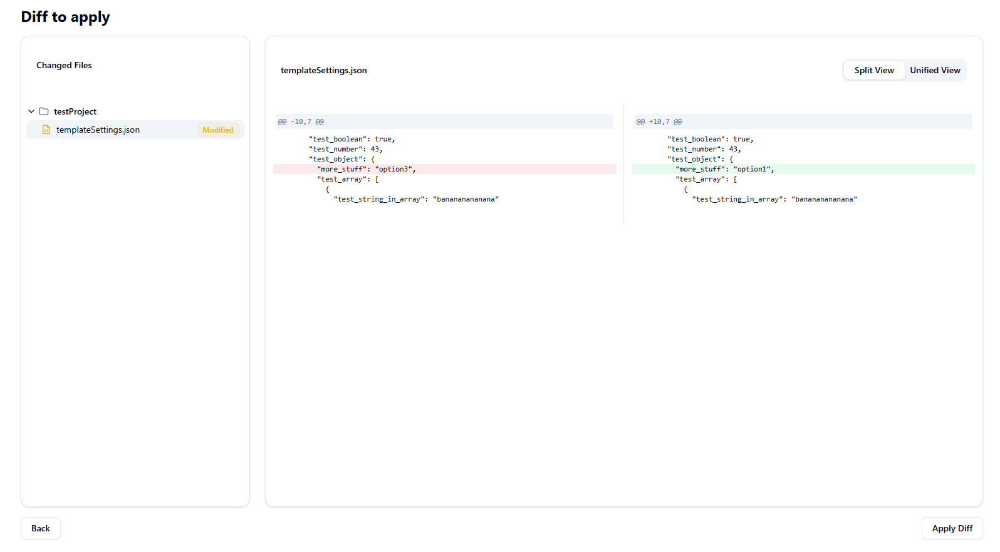

<p align="center">
  
</p>

#

<p align="center"><strong>TypeScript-powered scaffolding toolkit</strong> for shipping consistent, reproducible projects from curated templates.</p>

<p align="center">
  <a href="https://github.com/timonteutelink/skaff/actions/workflows/releaseCli.yml"></a>
  <a href="https://github.com/timonteutelink/skaff/actions/workflows/releaseWeb.yml"></a>
  <a href="https://github.com/timonteutelink/skaff/actions/workflows/releaseLib.yml"></a>
  <a href="https://github.com/timonteutelink/skaff/actions/workflows/releaseTypes.yml"></a>
</p>
<p align="center">
  <a href="https://www.npmjs.com/package/@timonteutelink/skaff"></a>
  <a href="https://www.npmjs.com/package/@timonteutelink/skaff-lib"></a>
  <a href="https://www.npmjs.com/package/@timonteutelink/template-types-lib"></a>
  
</p>
<p align="center">
</p>

<p align="center">
  <a href="https://timonteutelink.github.io/skaff">Documentation</a>
  &nbsp;&nbsp;•&nbsp;&nbsp;
  <a href="https://discord.gg/efVC93Cr">Discord</a>
</p>

## Installation

The CLI can be used without a global install.

### `bunx`

```bash
bunx @timonteutelink/skaff --version
```

### Global install

If you prefer a permanent install:

```bash
npm install -g @timonteutelink/skaff
# or, with bun:
bun add -g @timonteutelink/skaff
```

### GitHub releases

Prebuilt binaries for major platforms are attached to each GitHub release. Download the appropriate binary and place it on your `PATH`.

### Nix flake

skaff is packaged as a Nix flake. To run it:

```bash
# run directly from GitHub
nix run github:timonteutelink/skaff

# or from a local checkout:
nix develop       # enter a dev shell with all dependencies
nix build         # build the package
nix run           # execute the CLI
```

## Quickstart

To scaffold a new project from a template, call the `project new` command. This example generates a **FastAPI** service named `banana` from the [`example-templates` repository](https://github.com/timonteutelink/example-templates):

```bash
bunx @timonteutelink/skaff project new banana \
  --repo github:timonteutelink/example-templates \
  fastapi
```

This will clone or fetch the `fastapi` template, prompt you for required values and options, then produce a ready‑to‑run FastAPI application. For an overview of available commands and options, run:

```bash
skaff --help

```

## Overview

**skaff** helps teams standardize how they start new services, microservices and libraries. It codifies best practices into reusable templates, prompts you for the variables that matter, and writes out a ready‑to‑run project. Because templates are versioned and configured with Zod schemas, they remain type‑safe and upgradeable. The CLI runs anywhere Node or Bun can, prebuilt binaries can be downloaded from releases, and a Nix flake is provided for reproducible builds.

## Features

- **One‑command scaffolding.** Generate a new project or apply a subtemplate with a single command or click. A guided prompt collects the name, options and feature flags and applies them consistently across all files and configs.
- **Diff preview and patching.** skaff shows you exactly what will be created or changed. For existing projects it generates a git patch so you can inspect and commit the changes yourself.
  
- **Multi‑platform distribution.** Use it instantly via `npx` or `bunx`, install globally with npm or bun, download a prebuilt binary, or run it as a reproducible Nix flake.
- **Visual Web UI.** A Next.js powered interface allows you to browse templates, fill in form fields, preview the resulting file tree or diff, and apply patches without touching the terminal
- **Flexible configuration.** Configure where your templates live and where to create projects through a simple JSON config or environment variables like `TEMPLATE_DIR_PATHS`, `PROJECT_SEARCH_PATHS`. Point Skaff at local directories or GitHub repositories and it will clone the latest templates for you. Skaff recognises GitHub repositories declared as shorthand (`github:`/`gh:`), full HTTPS or SSH URLs, and even `file://` URIs. Append `@branch` (for shorthands) or `#branch` (for URLs) to pin a specific branch when loading templates.
- **Language agnostic.** Templates can target any stack like FastAPI, React, Go and Rust as long as they ship a schema. Additional template repositories can be referenced with `--repo` or configured once in `settings.json`.

## How it works

When you invoke skaff, it will:

1. Resolve the template source (local directory, configured paths or a remote repo).
2. Read the template’s schema and definitions from `templateConfig.ts`.
3. Prompt you for the required inputs, validating them with Zod.
4. Generate files and configuration into the target directory.
5. Produce a git diff or patch so you can review and commit the changes.

Templates may also include tasks, linting and formatting setups so that your new project is productive out of the box.

## Plugin discovery and extensibility

- Each `templateConfig.ts` can declare an optional `plugins` array describing plugin module specifiers and options. Skaff only
  activates a plugin when that specific template is being generated.
- A shared loader exported from `@timonteutelink/skaff-lib` (`loadPluginsForTemplate`) resolves these modules relative to the
  template repository's `package.json`, making the same discovery rules available to both the CLI and the Web UI.
- Plugins target the `TemplateGenerationPlugin` interface, which receives a `PipelineBuilder` seeded with the default stages so
  they can inject, replace or remove steps while keeping the base pipeline intact and deterministic when no plugins load.
- Plugins can persist namespaced data under `instantiatedTemplates.<id>.plugins.<pluginName>` using the shared
  `TemplatePluginSettingsStore`; these values are written to `templateSettings.json` alongside other template settings.
- CLI plugins can surface commands through `skaff plugin run --list` / `--command <name>` while web plugins return lightweight
  notices that the UI can render next to project details.
- Template authors who publish plugin-specific type helpers can keep them separate from runtime code—for example, the
  `@timonteutelink/skaff-plugin-greeter-types` package demonstrates a declaration-only helper that templates can import to type
  their plugin options without adding runtime weight.
- Example plugins can be split by surface area: the greeter sample ships as
  `@timonteutelink/skaff-plugin-greeter` (generation pipeline),
  `@timonteutelink/skaff-plugin-greeter-cli` (commands and interactive
  settings wrappers), and `@timonteutelink/skaff-plugin-greeter-web` (React UI
  stages) so templates only depend on the pieces they need.

## Security

Skaff executes user‑provided template code (such as `templateConfig.ts` and plugins) in a hardened sandbox powered by [SES (Secure ECMAScript)](https://github.com/endojs/endo/tree/master/packages/ses). This ensures that untrusted code cannot escape its boundaries.

### Sandbox guarantees

| Property                    | Description                                                                                                                                                                    |
| --------------------------- | ------------------------------------------------------------------------------------------------------------------------------------------------------------------------------ |
| **No filesystem access**    | Sandboxed code cannot read, write or list files.                                                                                                                               |
| **No network access**       | No `fetch`, `XMLHttpRequest` or Node.js `http` available.                                                                                                                      |
| **No process/environment**  | `process`, `child_process` and environment variables are blocked.                                                                                                              |
| **Frozen intrinsics**       | All built‑in prototypes (`Object`, `Array`, `Function`, etc.) are frozen after `lockdown()`, preventing prototype pollution.                                                   |
| **Deterministic execution** | `Date.now()` and `Math.random()` are disabled by default for reproducible builds.                                                                                              |
| **Whitelisted imports**     | Only explicitly allowed modules can be `require()`d: `yaml`, `zod`, `handlebars`, and `@timonteutelink/template-types-lib`. Plugins additionally receive a minimal React stub. |

### Where sandboxing is applied

All untrusted code paths go through `HardenedSandboxService`:

1. **Template configuration** – `templateConfig.ts` files are bundled and evaluated via `evaluateCommonJs()`.
2. **Plugin code** – Plugins declared by templates are loaded and executed in the same sandbox.
3. **`mapFinalSettings`** – Custom settings transformers run via `invokeFunction()`.
4. **Side‑effect transforms** – Transform functions in side effects execute sandboxed.
5. **Handlebars helpers** – Helpers defined in templates run via `invokeFunctionWithArgs()`.

### Limitations

- **No timeout enforcement.** SES accepts a `timeoutMs` option but does not enforce it. Infinite loops in template code will block execution.
- **Memory limits.** There is currently no memory cap; a template could allocate unbounded memory.

For details see `packages/skaff-lib/src/core/infra/hardened-sandbox.ts`.

## CLI

The CLI follows the standard `skaff <command> [options]` pattern. Common commands include:

- `skaff project new <name> [template]` – create a new project or subproject.
- `skaff help [command]` – print detailed help for a command.

Run `skaff --help` to see the full list of commands and flags.

## Web interface

In addition to the CLI, skaff provides a Web UI. The Web interface makes it easy to browse templates, enter values through forms, preview the file tree or diff and apply the changes interactively

### Using Docker

The recommended way to run the Web UI is via Docker. Pull the image and run it on port 3000:

```bash
docker run -p 3000:3000 -v ~/projects/templated:/projects timonteutelink/skaff:latest
```

Now open **http://localhost:3000** in your browser. The volume mount allows the UI to read your `~/projects/templated` directory.

### Running locally

If you have Node.js and bun or Bun installed, you can run the Web UI from source:

```bash
bun install
bun build
bun --filter apps/web dev
```

Open http://localhost:3000 to access the interface. When running locally the app uses your home directory’s `~/.config/skaff` by default, and you can update the settings through the UI.

## Contributing

We appreciate contributions of all kinds. Please see [CONTRIBUTING.md](./CONTRIBUTING.md) for the full guide. In summary:

- Set up the monorepo with `bun install` and build the core libs
- Use `bun test` to run unit tests, and run `bun format` / `bun lint` before committing
- Work on a feature branch and open a Pull Request against `main`. PRs run continuous integration and should be kept focused
- Releases are handled by maintainers via semantic versioning and GitHub Actions; you usually don’t need to publish packages yourself

## License

This project is licensed under the MIT License. See the [LICENSE](./LICENSE) file for details.

---

## Documentation & community

- **Documentation:** The full manual and API reference are hosted at [timonteutelink.github.io/skaff](https://timonteutelink.github.io/skaff).
- **Community:** Join our Discord to ask questions and share ideas: [https://discord.gg/efVC93Cr](https://discord.gg/efVC93Cr).

---
